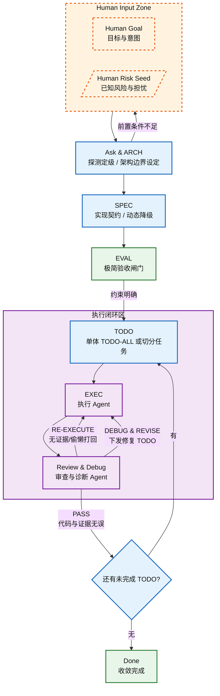

# Human Guide：本 AI Harness 决策点

## 写在前
- 人类不应在实现阶段继续与 Agent 讨论架构。若实现阶段发现问题，应回到 ARCH / SPEC 修改约束，再重新生成 TODO，而不是在代码 diff 中口头纠偏。
- 在代码完全收敛（正确执行、编译通过、交叉验证完成）之前，人类禁止逐行阅读或试图理解生成物。一旦察觉失控，应立即停止，并回退到 TODO 之前的 ARCH 和 SPEC。

## 流程图


## Why not 一段式指令
在“一段式指令”下，随着工程复杂度提升，Agent 极易自作主张，产出架构错误、范式混乱，以及可运行但不可维护的垃圾代码。

最终结果是人类审核成本极高、收敛极慢，token 与时间被大量浪费。

反例：
```text
请把 base.py 改造成支持并行、连接复用、故障熔断、文件传输统一入口、兼容历史平台并尽量优雅
```

## 核心理念：可审核的约束
AI Harness 的核心不是让 Agent 少做事，而是让 Agent 在正确边界内做事。
- 正目标负责前进。
- 负约束负责不跑偏。
- 目标决定方向。
- 边界决定可控性。
- 证据决定是否完成。

Agent 失控，通常不是因为它不知道要做什么，而是因为它不知道什么不能做。因此，负约束很重要。

不仅如此，约束更重要的价值是把人类审核点前移，让人能在代码生成前审方向、审边界、审契约，最终保证代码的可审核性。

## 约束不能太过
负约束不等于替 Agent 写代码，也不等于替 Agent 填满文档。真正要锁的是工程边界，而不是实现路径；要锁的是信息质量，而不是产物形状。

过度限制通常不会比完全没有限制更糟，但会带来明显副作用：
- 大模型解决问题的方式变得机械，效果变差。
- 输出填空化，小任务被包装成大文档。
- 为了满足章节完整性，反而制造幻觉需求。
- 生成的 ARCH / SPEC / EVAL / TODO 看起来完整，但信息密度下降。

好的 Harness 应该做到：
```text
边界硬，目标硬，证据硬，实现软。
```

应该锁死的是：
- Scope
- Preserve
- DO NOT
- Validation
- Evidence
- Out of Scope

不应轻易锁死的是：
- helper 怎么拆
- 内部变量怎么命名
- 是否必须引入某个 class
- 是否必须按人类想象的微步骤实现
- 是否必须长成某种“优雅”的代码形状 (包括生成的md!)

## 为什么 ARCH 和 TODO 中间必须有 SPEC
ARCH -> TODO 的跃迁过大，会直接破坏人类的审核能力。

没有 SPEC 时：
- ARCH 只说明方向，TODO 只是任务清单
- 实现契约缺失
- Agent 会自行决定抽象、接口、状态和错误语义
- 人类只能在代码生成后审核

SPEC 的作用不是“补充细节”，而是将架构原则转译为可审核的实现契约。
```text
ARCH：审方向。
SPEC：审约束。
TODO：审施工。
```

## 为什么EVAL不让Agent发掘Unit Test
Agent 自行发掘出的 Unit Test，常见问题是：相对任务本身复杂度爆炸，人类无法有效审核，且下游极易写出 false pass。

工程上，应由人类在 Agent 配合下，先行收敛最小关键测试场景，并给出真实测试环境信息。

EVAL 的目标不是追求覆盖率，而是卡住关键风险路径。

## 为什么需要 REVIEW 单独出来
生成者天然容易相信自己的输出，而模型能力决定了施工质量。

实战中，新 session 的高级 Agent 往往能抓出 EXEC 忽略的问题：越界修改、证据不足、兼容性破坏、false pass。

如果 TODO 生成质量够高，EXEC 底层模型对 coding 优化足够，整体效果可以接近开环；但 REVIEW 仍然是兜底证据门。

REVIEW 不负责重新设计，只负责判断是否完成、是否越界、证据是否成立。

## 前期架构也需要奥卡姆剃刀
如果不控制 Agent 只做必需规划，Agent 倾向于扩大范围，给出大而全的方案。

这会把本来局部的问题升级成系统级工程，导致后续 SPEC、EVAL、TODO 和 REVIEW 的复杂度连锁膨胀。

ARCH 阶段的默认策略应是：
```text
先闭环，再优雅。
先兼容，再收口。
先最小机制，再扩展设计。
```

## L0 / L1 / L2：流程必须能收缩
不是所有任务都值得跑满流程。

L0 - 极简：极简脚本 / 胶水任务
L1 - 轻量：单模块特性 / 局部改造
L2 - 完整：系统级重构 / 多模块兼容性改造

否则会将简单任务过度复杂化，影响生成时间和质量。